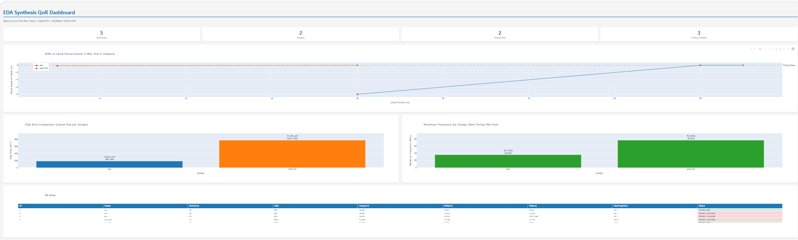

# EDA Synthesis Flow Automation Framework

A production-style EDA flow automation framework using open-source tools,
demonstrating the same engineering discipline used in commercial CAD/flow
development environments.

## Tools & Technologies
| Tool | Purpose | Commercial Equivalent |
|------|---------|----------------------|
| Yosys 0.52 | RTL Synthesis | Cadence Genus |
| OpenSTA 2.0.17 | Static Timing Analysis | Cadence Tempus / Synopsys PrimeTime |
| SkyWater 130nm PDK | Standard Cell Library | TSMC / Samsung foundry PDK |
| Python + Jinja2 | Flow Automation | Internal CAD scripts |
| SQLite | QoR Run Tracking | Internal CAD databases |
| Plotly | QoR Dashboard | Internal reporting tools |

## Framework Architecture
run_synthesis.py # Single-command flow orchestrator
├── configs/ # Per-design YAML configuration
│ ├── picorv32.yaml # RISC-V processor
│ └── aes.yaml # AES-128 encryption core
├── templates/ # Jinja2 templates (auto-generate tool scripts)
│ ├── synthesize.ys.j2 # Yosys synthesis script
│ ├── constraints.sdc.j2# SDC timing constraints
│ └── run_sta.tcl.j2 # OpenSTA timing analysis script
└── scripts/
├── parse_qor.py # Log parser: WNS/TNS/area/cells
├── qor_database.py # SQLite QoR run tracking
└── gen_dashboard.py # Plotly HTML dashboard generator

## Quick Start

```bash
# Install dependencies
pip install jinja2 pyyaml plotly pandas tabulate

# Run full flow (synthesis + timing analysis)
python3 run_synthesis.py --design picorv32

# Override clock period
python3 run_synthesis.py --design picorv32 --period 13.0

# Run on AES-128 core
python3 run_synthesis.py --design aes --period 29.0

# Generate QoR dashboard
python3 scripts/gen_dashboard.py
```

## Results

### PicoRV32 RISC-V Processor
| Metric | Value |
|--------|-------|
| Standard cells | 8,041 |
| Chip area | 77,250 µm² |
| Sequential elements | 58.0% |
| Critical path | 12.36 ns |
| Maximum frequency | **76 MHz** |
| Timing at 20ns | ✅ MET (WNS = 0.000 ns) |
| Timing at 13ns | ❌ VIOLATED (WNS = -0.160 ns) |

### AES-128 Encryption Core
| Metric | Value |
|--------|-------|
| Standard cells | 997 |
| Chip area | 18,401 µm² |
| Sequential elements | 70.4% |
| Critical path | 27.21 ns |
| Maximum frequency | **35.7 MHz** |
| Timing at 29ns | ✅ MET (WNS = 0.000 ns) |
| Timing at 28ns | ❌ VIOLATED (WNS = -0.010 ns) |

## QoR Dashboard
The framework generates an interactive HTML dashboard showing:
- WNS vs clock period (timing closure sweep)
- Chip area comparison across designs
- Maximum frequency per design
- Full run history table with color-coded status



## How This Maps to Commercial EDA Flows

This framework demonstrates the same engineering patterns used in
production CAD environments:

| This Framework | Commercial Equivalent |
|---------------|----------------------|
| `configs/*.yaml` | Design configuration management |
| Jinja2 Tcl templates | Parameterized Genus/Innovus scripts |
| `parse_qor.py` | Automated report parsing |
| SQLite run database | QoR regression tracking |
| Plotly dashboard | Internal signoff dashboards |
| `--period` sweep | Timing closure exploration |

The Yosys/OpenSTA commands map directly to their Cadence equivalents:
- `read_liberty` → `set_db library`
- `synth -top` → `syn_generic` + `syn_map` + `syn_opt`
- `report_wns` / `report_tns` → `report_timing -summary`

## Designs Used
- **PicoRV32**: Open-source RISC-V processor by YosysHQ
- **AES-128**: Open-source AES encryption core by secworks
- **PDK**: SkyWater 130nm open-source foundry library
